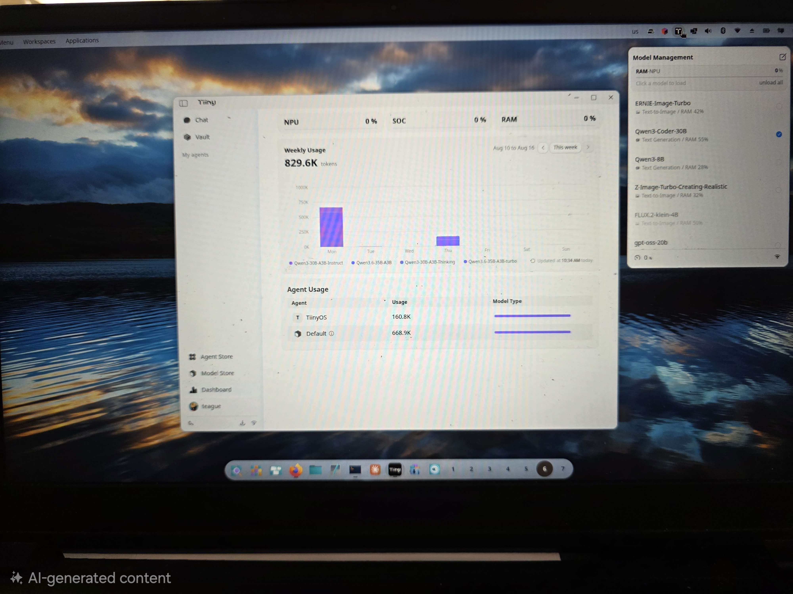

# TTt — Teague's Tiiny Tools

Tools and field notes for the **Tiiny Pocket**: a command-line client, helpers
for the device's APIs, diagnostics for when it goes quiet, and the recipe for
running the desktop app natively on Linux.

Unofficial and not affiliated with the vendor. Written against a single unit, so
some of what is documented here is undocumented upstream and may change.



## Start here

```bash
git clone https://github.com/teaguesterling/TTt.git ~/tiiny-tools
~/tiiny-tools/bin/ttt doctor     # checks every hop and names the one that failed
```

**Nothing else to configure if you have used the vendor `tiiny` CLI.** It runs
natively on Linux, and `tiiny scan && tiiny connect && tiiny login` writes both
things `ttt` needs — the device's address and the auth key — to
`~/.tiiny/config.json`. `ttt` reads them from there. No Wine, no `pcsvr`, no
bridge host.

`doctor` before `status`: it walks name → port 80 → `/data` → management API →
NPU and tells you which hop broke, where `status` only reports the end state.

Overrides come in two independent kinds, so they have two precedences. The
**auth key**, highest first:

| | |
|---|---|
| `TIINY_AUTH_KEY` | the key, explicitly |
| `pcsvr`'s `auth_data/<serial>.json` | used when it exists (the desktop-app host) |
| `~/.tiiny/config.json` | the vendor CLI's `account.authKey` |

And the **address**, which is resolved separately and is not an auth source at
all:

| | |
|---|---|
| `TIINY_IP` | checked first: talk straight to an address, skipping name resolution |
| `TIINY_HOST`, else `api.tiiny` | the name, when it resolves |
| `~/.tiiny/config.json` | the vendor CLI's `deviceAddress`, when the name does not |

The default host is the *name* `api.tiiny`, which assumes a bridge host running
dnsmasq and Caddy. That is worth building eventually — it survives the device's
DHCP drift and its roam-unstable radio, see [Networking](docs/networking.md) —
but it is not where to start, and when the name does not resolve `ttt` falls
back to the vendor config's address rather than failing.

`ttt` is the companion CLI: ask questions about a codebase, run one-shot
prompts, generate images, embed text, OCR a screenshot, swap the loaded model,
and check what the device is doing.

```
ttt ask    "<question>"                 ask the device anything (the default)
ttt ask    --code [DIR] "<question>"    agentic code intelligence over DIR
ttt ask    --librarian "<question>"     answer from a tiibrarian corpus (loose)
ttt do     "<intent>" [--path DIR]      sandboxed file task (lackpy, local)
ttt code   "<prompt>"                   direct coding, via woollama
ttt review <file>                       first-pass code review, via woollama
ttt judge  <rubric> <candidate>         grade a candidate against a rubric
ttt image  "<prompt>" [--out F]         image generation
ttt embed  "<text>" | --file F          local embeddings
ttt ocr    <image>                      image → text
ttt asr    <audio>                      speech → text (~6x real time)
ttt say    "<text>" [--voice F1] [--play]   text → speech
ttt listen [--seconds N]                microphone → text
ttt music  "<description>" [--full]     text → music (a WAV, on the device)
ttt rerank "<query>" <candidate> …      order candidates by relevance
ttt prompt ["<text>"] [--template F]    ask the device; reads stdin, writes stdout
ttt dialog ["<text>"]                   the same, in a zenity entry + answer window
ttt duckeye "<request>" [--dry-run]     device writes a duckeye command, run as argv
ttt load   <alias|ID>  /  ttt unload    aliases from ~/.config/ttt/models
ttt models                              what's loaded right now
ttt top                                 NPU budget + what's resident
ttt status                              device health, including the lock state
ttt doctor                              check the whole path in one go
ttt logs   ["<text>"] [--errors]        the device's own service log
ttt api    <PATH> [--post JSON]         anything the wrappers don't cover
ttt unlock                              unlock /data after a reboot
```

`code`, `review` and `judge` post to `127.0.0.1:47600`: they need a local
woollama router ([docs/woollama.md](docs/woollama.md)). Everything else talks
to the device.

`load` and `unload` hand off to the vendor `tiiny` CLI when it's installed, and
fall back to the API when it isn't. Aliases (`fast`, `smart`, `coder`, `tts`, …)
are yours to redefine — see [`deploy/ttt.models.example`](deploy/ttt.models.example).

**These are plumbing.** One payload rule everywhere: a bare argument is the
payload (text for text commands, a path for file ones), `-` is stdin, and
`--text` / `--file` are the explicit spellings. With no argument, a piped stdin
is read anyway. Results go to stdout, progress to stderr:

```bash
ttt listen | ttt prompt --template card.md | duckeye -Q -    # speech → selector → code
cat notes.md | ttt prompt "summarise this" | ttt say --play
```

[`examples/voice-code-query.sh`](examples/voice-code-query.sh) is the whole
chain: ask a codebase a question out loud, hear the answer. Microphone → a
selector → local AST retrieval with `duckeye -Q` → a summary → speech, as five
pipes.

## Documentation

| | |
|---|---|
| [**Running the desktop app on Linux**](docs/linux-desktop.md) | TiinyOS ships Windows-only. Native Electron for the app, patched Wine for the PC Service. |
| [**Fronting the device with woollama**](docs/woollama.md) | A queue, on-demand model loading and one stable endpoint in front of a single-session device. |
| [From scratch](docs/from-scratch.md) | Bare machine → working stack, in order. |
| [Architecture](docs/architecture.md) | What runs where, what depends on what, in what order. |
| [Troubleshooting](docs/troubleshooting.md) | **Start here when something is broken** — ordered by what actually goes wrong. |
| [Networking](docs/networking.md) | The three ways to reach the device, and why the stable one is the USB link. |
| [APIs](docs/apis.md) | Every service the device exposes: ports, auth, LAN exposure. |
| [Model service API](docs/device-api.md) | The 132-path model API: lifecycle, the three inference dialects, and the traps. |
| [Model import API](docs/model-import-api.md) | Importing from Hugging Face, including which fields lie. |
| [Where Tiiny fits](docs/where-tiiny-fits.md) | Measured wins and losses: which work belongs on the device at all. |
| [Utilities](docs/utilities.md) | Every tool in `bin/`, env conventions, host requirements. |

## What's in here

```
bin/       ttt and friends: the CLI, one-shot prompts, HuggingFace import,
           unlock after reboot, device discovery, a reachability watcher
launcher/  running the desktop app on Linux: build the native Electron tree,
           start pcsvr under Wine, unhide Linux agents in the store
wine/      the two Wine patches the PC Service cannot run without
deploy/    systemd user units for the watcher and the woollama router
docs/      everything above
```

## Two things that will save you an hour

- **Everything 502s** → the device booted with `/data` locked, and the device
  says nothing about it. Run `ttt unlock`. (Any `ttt` command that hits a 502
  tells you this instead of printing the number.)
- **A bare `fetch failed`** → name resolution, nearly always. The same string
  covers "cannot resolve", "device off" and "connection refused".

## Contributing

Issues and pull requests welcome, particularly corrections: much of this was
measured on one unit, and a second data point is worth more than a tidy-up.
