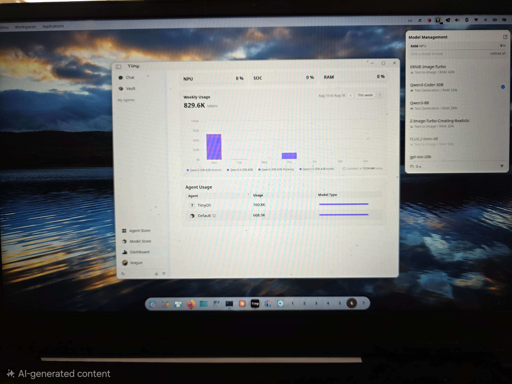

# Teague's Tiiny Tools

Tools and field notes for the **Tiiny Pocket**: a command-line client, helpers
for the device's APIs, diagnostics for when it goes quiet, and the recipe for
running the desktop app natively on Linux.

Unofficial and not affiliated with the vendor. Written against a single unit, so
some of what is documented here is undocumented upstream and may change.



## Start here

```bash
git clone https://github.com/teaguesterling/TTt.git ~/tiiny-tools
export TIINY_AUTH_KEY=...        # from pcsvr's auth_data/<serial>.json
~/tiiny-tools/bin/ttt status
```

If that prints device health, everything else on this site will work. If it
prints a 502, the device booted with `/data` locked — run `ttt unlock`.

## The two things that will save you an hour

!!! warning "Everything 502s"
    The device booted with `/data` locked, and it says nothing about it. Run
    `ttt unlock`. Any `ttt` command that hits a 502 tells you this instead of
    printing the number.

!!! warning "A bare `fetch failed`"
    Name resolution, nearly always. The same string covers "cannot resolve",
    "device off" and "connection refused". See [Networking](networking.md).

## Where to go next

| If you want to… | Read |
|---|---|
| Set a machine up from nothing | [From scratch](from-scratch.md) |
| Run the desktop app on Linux | [Running the desktop app on Linux](linux-desktop.md) |
| Put a queue and one stable endpoint in front of the device | [Fronting the device with woollama](woollama.md) |
| Fix something that is broken | [Troubleshooting](troubleshooting.md) |
| Call the device's APIs yourself | [Model service API](device-api.md) |
| Know whether a job belongs on the device at all | [Where Tiiny fits](where-tiiny-fits.md) |

## The CLI

`ttt` is the companion CLI: ask questions about a codebase, run one-shot
prompts, generate images, embed text, OCR a screenshot, swap the loaded model,
and check what the device is doing.

```
ttt ask    "<question>" [--path DIR]    agentic code intelligence
ttt code   "<prompt>"                   direct coding
ttt image  "<prompt>" [--out F]         image generation
ttt embed  "<text>" | --file F          local embeddings
ttt ocr    <image>                      image → text
ttt asr    <audio>                      speech → text (~6x real time)
ttt say    "<text>" [--voice F1] [--play]   text → speech
ttt listen [--seconds N]                microphone → text
ttt music  "<description>" [--full]     text → music (a WAV, on the device)
ttt rerank "<query>" <candidate> …      order candidates by relevance
ttt prompt ["<text>"] [--template F]    ask the device; reads stdin, writes stdout
ttt dialog ["<text>"]                   the same, in a zenity entry + answer window
ttt load   <alias|ID>  /  ttt unload    aliases from ~/.config/ttt/models
ttt models                              what's loaded right now
ttt top                                 NPU budget + what's resident
ttt status                              device health, including the lock state
ttt doctor                              check the whole path in one go
ttt logs   ["<text>"] [--errors]        the device's own service log
ttt api    <PATH> [--post JSON]         anything the wrappers don't cover
ttt unlock                              unlock /data after a reboot
```

Every command follows one payload rule: a bare argument is the payload (text
for text commands, a path for file ones), `-` is stdin, and `--text` / `--file`
are the explicit spellings. Results go to stdout, progress to stderr — so the
commands compose:

```bash
ttt listen | ttt prompt --template card.md | duckeye -Q -    # speech → selector → code
cat notes.md | ttt prompt "summarise this" | ttt say --play
```

[Utilities](utilities.md) documents every tool in `bin/`.

## Contributing

Issues and pull requests welcome, particularly corrections: much of this was
measured on one unit, and a second data point is worth more than a tidy-up.
